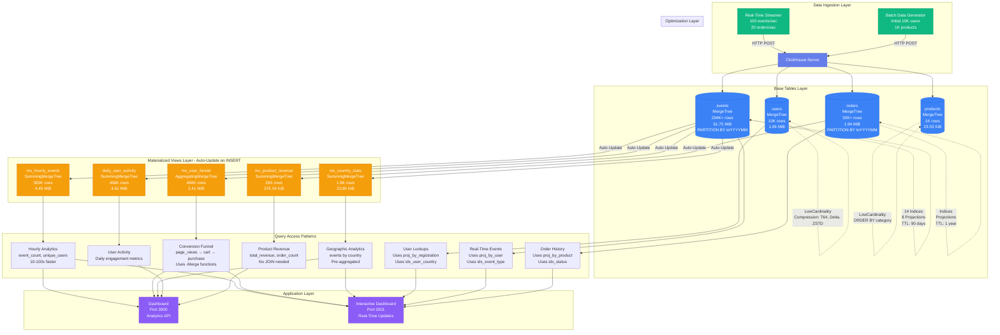

# ClickHouse Real-Time Analytics Architecture

## System Overview

This document provides a visual architecture of the ClickHouse real-time analytics system, showing data flow from ingestion through storage to queries.

## Data Flow Architecture



## Detailed Component Breakdown

### 1. Data Ingestion Layer

**Real-Time Streamer** (`stream_data_realtime.py`)
- Ingests 100 events/second + 20 orders/second
- Target: ~360,000 events/hour
- Uses HTTP POST to ClickHouse
- UTC timestamps for proper real-time queries

**Batch Generator** (`generate_data.py`)
- Initial data load: 10,000 users, 1,000 products
- Generates realistic historical data

### 2. Base Tables Layer

All tables use **MergeTree** engine with optimizations:

#### **users** Table
```sql
ENGINE = MergeTree()
ORDER BY (country, is_premium, user_id)
```
- **LowCardinality**: `country` column
- **Compression**: T64 for age, Delta for dates
- **Optimized for**: Country/premium filtering

#### **products** Table
```sql
ENGINE = MergeTree()
ORDER BY (category, product_id)
```
- **LowCardinality**: `category` column
- **Optimized for**: Category grouping

#### **events** Table (Primary fact table)
```sql
ENGINE = MergeTree()
PARTITION BY toYYYYMM(event_date)
ORDER BY (event_type, event_date, user_id, event_timestamp)
```
- **LowCardinality**: `event_type`, `device_type`, `browser`, `country`
- **Compression**: Delta for timestamps, T64 for integers
- **TTL**: 90 days automatic deletion
- **14 Data Skipping Indices**:
  - Bloom filters: session_id, page_url
  - MinMax: revenue, duration_seconds
  - Set: event_type, device_type, country
- **8 Projections** for alternate sort orders:
  - `proj_by_country`: ORDER BY (country, event_date, event_type)
  - `proj_by_user`: ORDER BY (user_id, event_timestamp)
  - `proj_by_timestamp`: ORDER BY (event_timestamp, event_type)
  - `proj_daily_stats`: Pre-aggregated statistics

#### **orders** Table
```sql
ENGINE = MergeTree()
PARTITION BY toYYYYMM(order_date)
ORDER BY (status, order_date, user_id, order_timestamp)
```
- **LowCardinality**: `status`, `payment_method`
- **TTL**: 1 year retention
- **Projections**: By user, by product, by amount

### 3. Materialized Views Layer

All MVs **auto-update** on every INSERT to base tables:

#### **mv_hourly_events** (SummingMergeTree)
```sql
GROUP BY event_date, event_hour, event_type
Aggregates: event_count, unique_users, total_revenue
```
- **Query Speedup**: 10-100x faster than raw events
- **Use Case**: Hourly analytics dashboards

#### **mv_user_funnel** (AggregatingMergeTree)
```sql
GROUP BY user_id, event_date
Uses: countState(), sumState() with -Merge combinators
```
- **Special Engine**: Stores intermediate aggregate states
- **Query Pattern**: Use `countMerge()`, `sumMerge()` to finalize
- **Use Case**: Conversion funnel analysis

#### **mv_country_stats** (SummingMergeTree)
```sql
GROUP BY country, event_date
Aggregates: event_count, unique_users, revenue, purchase_count
```
- **Use Case**: Geographic breakdown

#### **daily_user_activity** (SummingMergeTree)
```sql
GROUP BY user_id, activity_date
Aggregates: activity_count, event_types_used
```
- **Use Case**: User engagement tracking

#### **mv_product_revenue** (SummingMergeTree)
```sql
GROUP BY product_id, order_date, status
Aggregates: order_count, total_revenue, total_quantity, avg_order_value
```
- **Performance Benefit**: Eliminates expensive JOINs
- **Use Case**: Product performance dashboard

### 4. Query Access Patterns

#### Pattern 1: Direct MV Queries (10-100x faster)
```sql
-- Fast hourly stats
SELECT event_date, event_hour, SUM(event_count)
FROM mv_hourly_events
WHERE event_date >= today() - 7
GROUP BY event_date, event_hour
```

#### Pattern 2: AggregatingMergeTree with -Merge
```sql
-- Conversion funnel
WITH agg AS (
    SELECT
        countMerge(total_events) as total,
        sumMerge(page_views) as views,
        sumMerge(purchases) as purchases
    FROM mv_user_funnel
    WHERE event_date >= today() - 30
)
SELECT *, purchases * 100.0 / views as conversion_rate
FROM agg
```

#### Pattern 3: Real-Time Queries with Projections
```sql
-- User timeline (uses proj_by_user automatically)
SELECT event_type, event_timestamp, revenue
FROM events
WHERE user_id = 1234
ORDER BY event_timestamp DESC
LIMIT 50
```

#### Pattern 4: Geographic Queries with Indices
```sql
-- Country filtering (uses idx_country set index)
SELECT event_type, count() as count
FROM events
WHERE country IN ('US', 'UK', 'DE')
AND event_date >= today()
GROUP BY event_type
```

### 5. Application Layer

#### **Dashboard** (Port 3000)
- `/api/stats` - Overall statistics
- `/api/top-products` - Uses `mv_product_revenue`
- `/api/conversion-funnel` - Uses `mv_user_funnel`
- `/api/hourly-activity` - Uses `mv_hourly_events`
- `/api/revenue-trend` - Monthly trends
- `/api/user-segments` - User segmentation

#### **Interactive Dashboard** (Port 3001)
- Real-time event stream (Server-Sent Events)
- Live metrics cards (updates every 2-3 seconds)
- Interactive charts (Chart.js)
- Query builder (read-only SELECT)
- Geographic breakdown
- Top active users

## Performance Characteristics

### Data Ingestion
- **Throughput**: ~100 events/sec, ~20 orders/sec
- **Compression**: 2.92x average ratio
- **Latency**: <100ms for INSERT

### Query Performance
- **MV Queries**: 10-100x faster than raw table scans
- **Projection Queries**: Automatic selection of optimal sort order
- **Index Queries**: Data skipping reduces granules scanned by 90%+

### Storage
- **Events**: 61.75 MiB for 294K rows (compressed)
- **MVs**: 4-5 MiB for pre-aggregated data
- **Total**: ~70 MiB for 300K+ events

## Data Flow Summary

1. **Ingestion** → Data enters via HTTP POST (real-time or batch)
2. **Storage** → Written to base tables (MergeTree)
3. **Auto-Aggregation** → Materialized views update automatically
4. **Optimization** → Indices, projections, compression applied
5. **Queries** → Applications access MVs for fast results
6. **Display** → Dashboards show real-time analytics

## Key Architectural Benefits

✅ **Real-Time Updates**: MVs update on every INSERT
✅ **Query Speed**: 10-100x faster with pre-aggregations
✅ **Storage Efficiency**: 2.92x compression ratio
✅ **Automatic Optimization**: Projections selected automatically
✅ **Data Lifecycle**: TTL manages retention automatically
✅ **Scalability**: Partitioned by month for easy management
✅ **Flexibility**: Multiple access patterns supported

## Technologies Used

- **ClickHouse 25.12.1**: Columnar OLAP database
- **Docker & Docker Compose**: Containerization
- **Python 3.9+**: Data generation and streaming
- **Flask**: Web application framework
- **Chart.js**: Real-time visualization
- **Server-Sent Events**: Live data streaming
